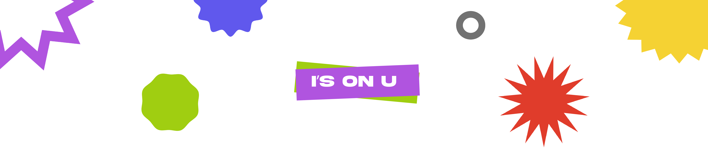

# ABOUT

I’S ON U is a web experience built on p5.js with the aim of showing the users the intangible presence of two spheres, the technological and the human one. I’S ON U is a group project designed for the Creative Coding course at Politecnico di Milano.

**SPOILER ALERT!** We encourage you to not read this document before using the website.

---

# 1. [PROJECT](#project)

## 1.1 [Theme](#theme)

## 1.2 [Aim](#aim)

## 1.3 [Concept](#concept)

## 1.4 [Context of use](#context-of-use)

## 1.5 [Device](#device)

---

# 2. [STRUCTURE](#structure)

# 3. [CHALLENGES](#challenges)

## 3.1 [Design](#design)

## 3.2 [Contents](#contents)

## 3.3 [Code](#code)

---

# 4. [REFERENCES](#references)

# 5. [TEAM](#team)


# PROJECT

## **THEME**

This project stems from a desire to interpret the theme of the presence of technology, in a context where it usually appears intangible. We have decided to explore the relationship between technology and user by showing their mutual presence through their interaction. Technology is a system which is constantly active and it can record, file and return imperceptible data to the users. Simultaneously users create a great mass of reactions (which are data used by the machine), unknowingly, unconsciously.

The starting point for this project has been a reflection about the huge amount of facial expressions we constantly do while we interact with devices and Apps such as WhatsApp. This example is something that can be applied to all contents to which we are exposed daily, starting from advertisement billboards to social media whose contents have been our first reference to be able to develop the project. Social media contents are specifically created to trigger emotions and to be shared; some of them are funny, some are sad, others are still too subjective in the sense that they provoke different emotions based on how we are. Technology is able to recognized everything we just said; by doing that it can show us its and the user’s presence even when the user thinks he is not doing anything besides acting passively.

## **AIM**

The aim of the project is to make the user aware that is constantly creating unconscious data such as emotions and reactions which can be detected and recorded by the presence of technology, and this happen every time he or she interacts with the machine. In order to do that we created a true experience where the users must immerge themselves.

## **CONCEPT**

The website has been designed to be used by only one user at the time. In order to enter the website, the user has to click on the “start” button; the experience itself begins with an introduction of the theme related to the fruition of audio-visual contents present on the web. Then five audio-visual contents, chosen randomly among a total of 28 contents, are showed to the user, who is being recorded by the webcam, without knowing, in order to track all the reactions and the emotions provoked. Once he or she has done watching the contents, a slide with the mission statement of the website is shown and afterwards it is possible to view the output. Latter shows the successful recording of emotions produced by the user through face photos and percentages detected. This information come with a sentence which is a kind of a comment that wants to cross the theme of the visul-audio content that has just been watched and the emotion that has been tracked during the fruition. These comments adopt an ironic tone of voice and sometimes judging in order to humanize the machine and exaggerate its presence, almost as if it were another person physically present in the same room and able to understand user reactions and formulate appropriate responses.

## **CONTEXT OF USE**

Because of how the website has been designed, it doesn’t require any particular attention for the setup itself; it can be used both in exhibitions and in informal settings. Only one user at the time can interact and use the website, but we want to underline the fact that the external presence of someone else, while a user is trying the experience, may affect the way he or she reacts to the contents that we are showing him/her. Indeed, from the tests conducted, when the user is with someone else enhances his/hers emotions and reactions by interacting also with the other person and not just with the machine.


## **DEVICE**

In order to use our website it is necessary to have a monitor with a webcam, a speaker and a touchpad or a mouse in order to allow the user to skip the pages whenever it is required.

# STRUCTURE

The website has been designed with the intent of being a true experience where the user immerge himself/herself without being aware of what it will happen during the evolution of the experience itself. The structure has been thought in order to reflect this aspect: we make the user believe that he/she is passively enjoying the contents and in the end we show him/her what has been his/hers active role during the interaction with the machine.

### HOMEPAGE

The Homepage is the first screen the user faces. It has been designed in a way that the user can’t really understand what the theme of the website is. The whole experience starts when the user clicks on the “Start” button.


### THIS IS YOU

The screen following the Homepage shows a video where a person is using his smartphone and the face of the user, who is interacting with the website, is overlaid on the top of the face of the person in the video. The purpose of this detail is since in this way we make the user believes that he/she allowed to the camera being turned on just to appear in this screen instead of the guy in the video. In this way we are able to record the user’s emotions and reactions during the whole experience, without him/her knowing the real reason why it was necessary for him/her to consent.

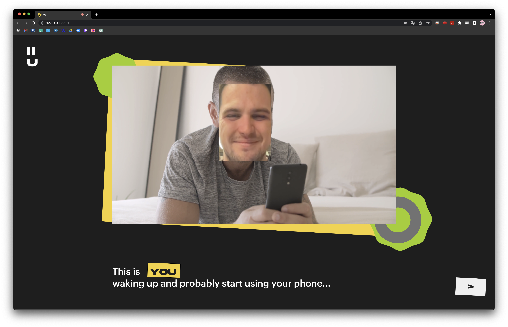

The storytelling continues in the next screen, which was begun with the video of the guy watching his smartphone; but this page works also as a contrivance to justify the fact that we are going to show the user a variety of contents, one after another.

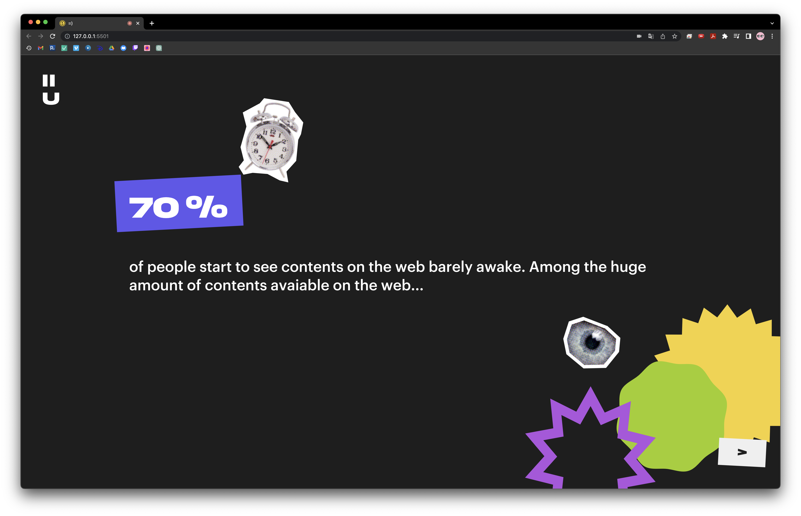

### CONTENTS

The experience goes on with the vision of five visual-audio contents, one after another, that have been chosen randomly among all the ones we have selected. While the user is watching the contents, we don’t give the option of switching from one to the other: once one of them is ended, the other one starts automatically and so on. This is because our goal is to prevent the user from skipping content, so that we can record his/her complete reactions to each video and present them back to him/her at the end in the form of output.


### EXPLANATION PAGE

Once the user has watched the five visual-audio contents, another screen appears. The purpose of this page is to make the user aware of the fact that during the experience he/she just had there have constantly been two different presences of whom he/she was unaware of. The first one is the presence of technology because, allowing the access of the webcam, the user allowed the machine to record him/her; the second one is the presence of the user himself/herself, in the sense that he/she showed emotions and reactions unconsciously produced as an answer to the contents he/she was watching. This page is also the connection ring between the first part of the website and the one that follows.


### OUTPUT - REACTION

Once the user has become aware of the fact that his/her reactions and emotions have been recorded through the whole experience until now, we want to show him/her what it has been effectively recorded. The user can see, for each content, the prevalent emotion that has been elicited; he/she can do it thanks to a path built on four screens. First, the user is shown what content is being considered, in order to create a direct connection between the emotion that has been felt and the content watched. Then the prevalent emotion is shown as a percentage. The following screen shows a sentence that links the user’s reaction and the audio-visual content. The purpose is to emphasize the presence of technology by humanizing it, and this detail is even more highlighted by the fact that all sentences refer directly to the user. As the last thing we want to show the user himself/herself through a picture that portrays him/her in the moment where the prevalent emotion felt was at its peak.
To summarize, the aim of the output with this structure is to reveal step by step the intangible presence of technology and of oneself, by allowing the user to visualize his/her reaction.

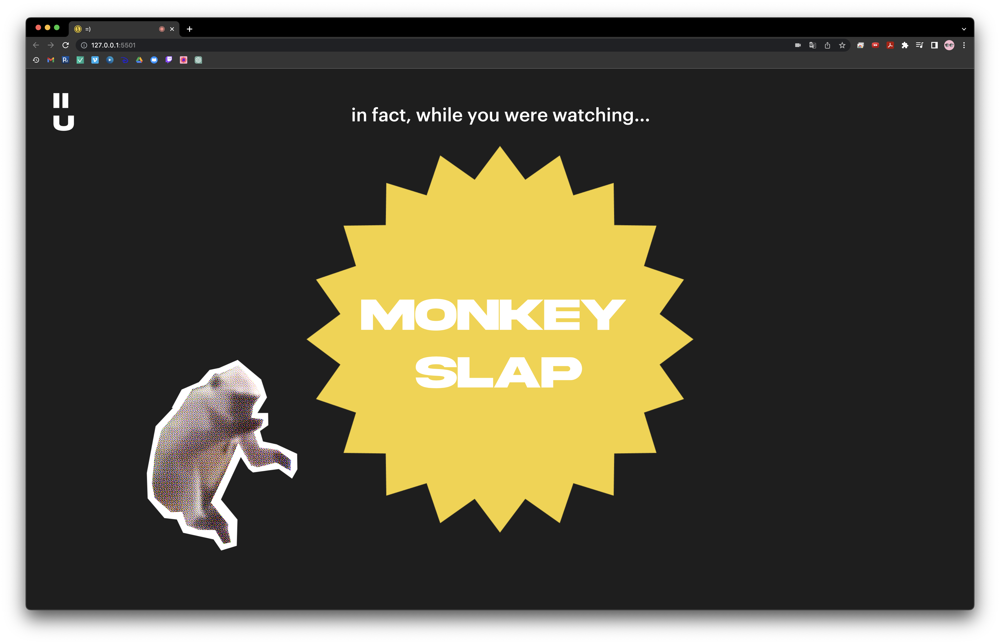
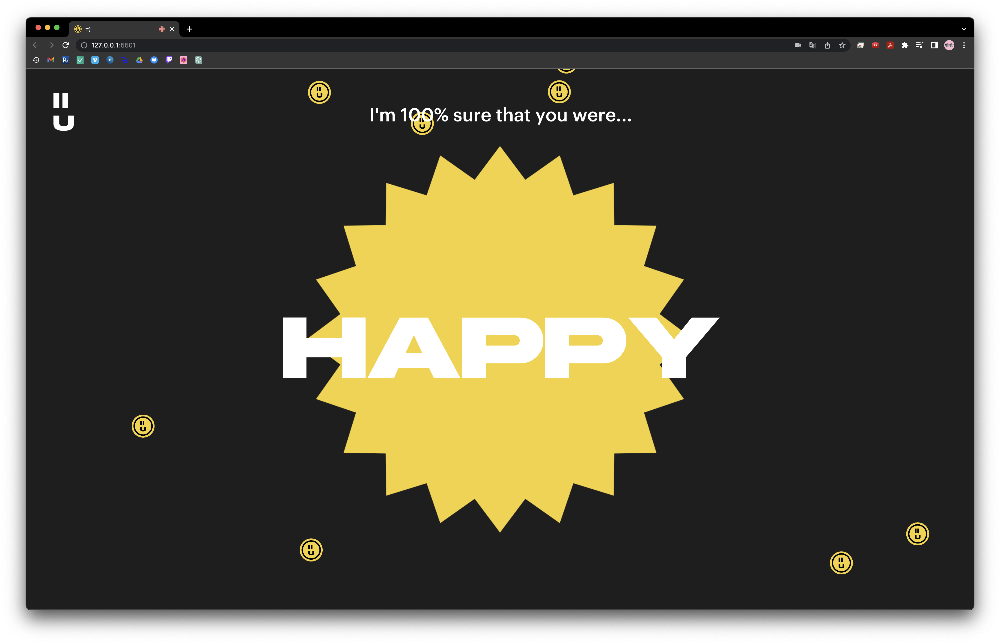
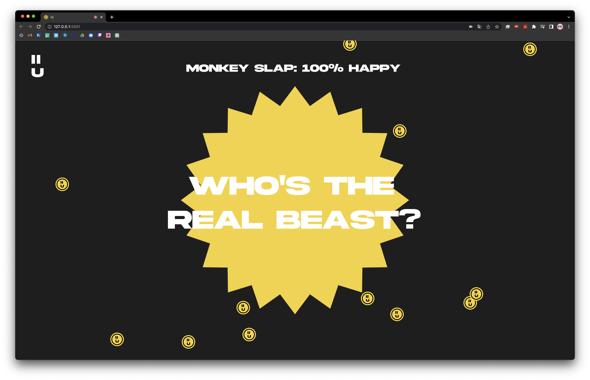
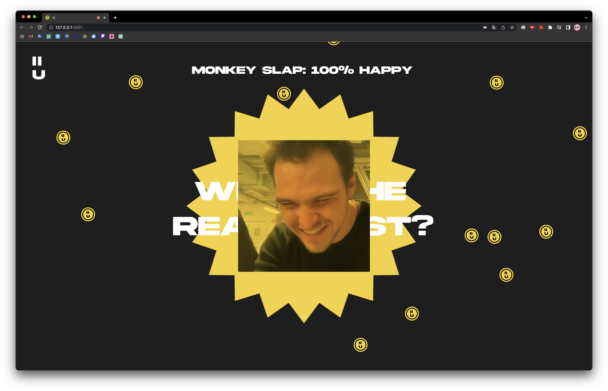

### OUTPUT 2 - REACTION'S REACTION

Our goal by showing the reaction of the reaction is to reaffirm the idea of the intangible and constant presence of technology and of ourselves, even when the experience seems to be ended. This revelation happens gradually too, through the succession of three different screens.

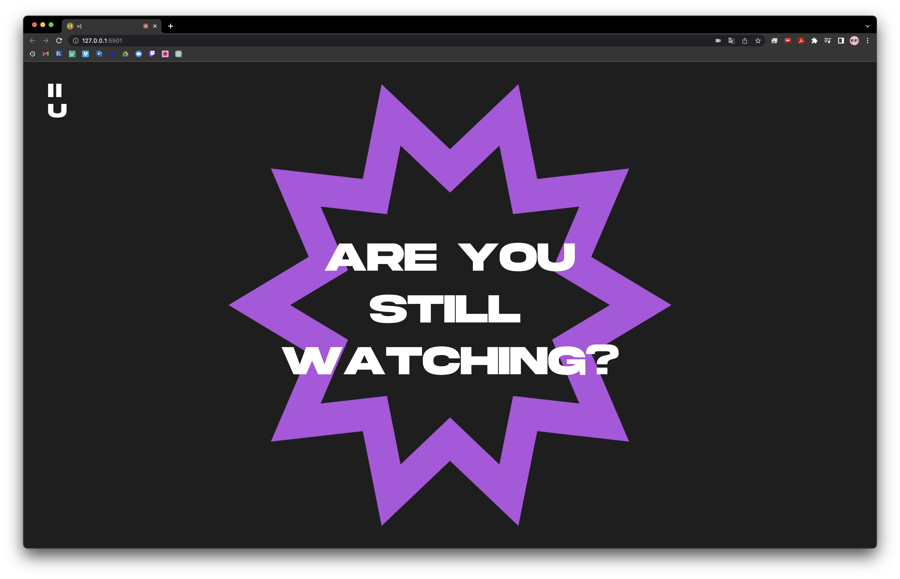
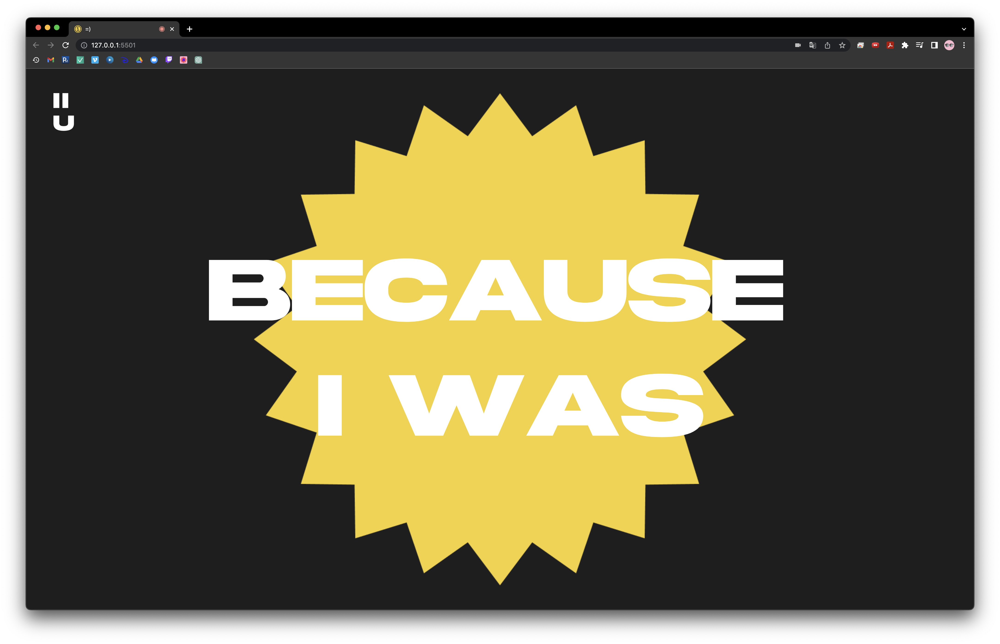


### ABOUT | RECAP

The last screen of the website shows two different options: the user can either explore more the project by clicking on the “About” button where he/she can see who has developed the website and why or the user can deepen more the experience that has just been lived by clicking on the “Recap” button.


The recap consists of a series of screens where we show the user in what percentage each emotion (happiness, sadness, disgust, indifference, surprise, anger), that was recorded, was experienced during the enjoyment of each content.

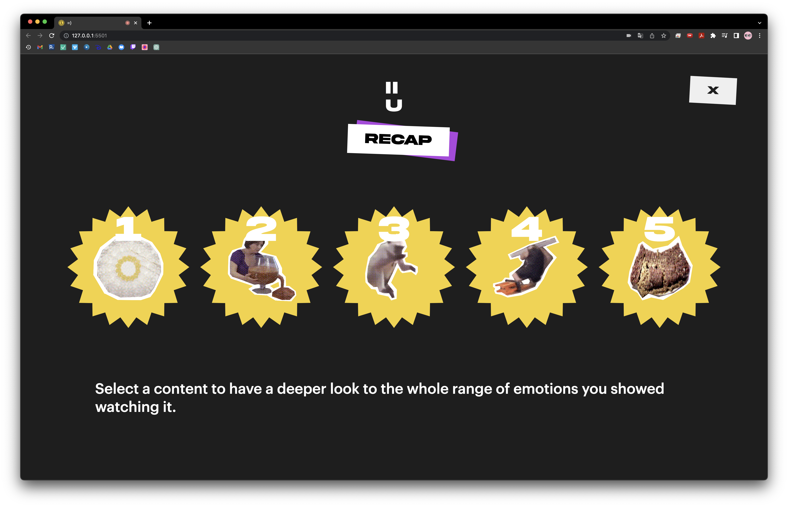
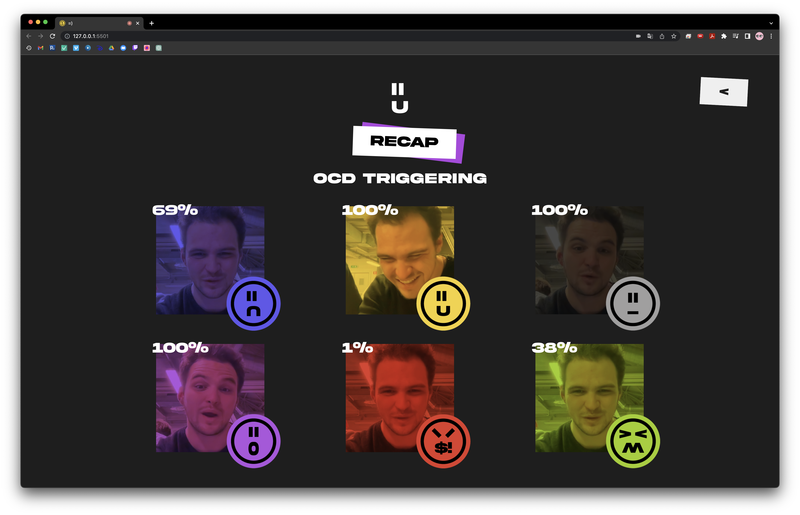

# CHALLENGES

## **DESIGN**

#### NAMING

Consistent with the theme of emotions, we designed typographic stickers that outline the visual appearance and tone of voice of the website. The logo itself, created using typefaces, helps to understand the naming through a wordplay. Two “I” are overlapped on a “U” and the two typefaces together create a smile; the phonetic expression is /I's on u/ which translates into the phrase "Eyes on You," emphasizing the constant presence of the technology's "gaze" on the user.


#### COLLAGE

The website uses audio-visual contents and this is the reason why we chose to combine flat shapes with the use of digital collage.


#### COLORS

Each one of the six emotions that we detect (happiness, sadness, disgust, indifference, surprise, anger), has been associated with a specific color and shape, based on the linked psychological effects.


## **CONTENTS**

#### VIDEO

Once we have defined the concept, a crucial first step has been to select all the video-contents based on quantities, quality and variety of emotions that could have been provoked with them. Their effectiveness has been proved through tests. Afterwards we deleted the contents which weren’t successful during our tests because they haven’t provoked any emotion or reaction into the user. On the other end, thanks to out tests, we discovered that the same content could provoke different reactions based on the user. Some emotions turned out to be too hard to provoke, for this reason we decided to not track the fear.

#### SENTENCES

We thought and wrote six different sentences for each content in order to cross each possible reaction felt by the user with a specific comment which is shown in the output. As mentioned above, this strategy emphasizes the humanization of the machine and the surprise of the user.

## **CODE**

#### FACE API

Face-api.js has been implemented for face and facial expression recognition. This library can detect 7 different expressions: happiness, sadness, anger, disgust, surprise, fear and neutrality.

es.

```JavaScript
// setup
faceOptions = {
  withLandmarks: true,
  withExpressions: true,
  withDescriptors: false,
  minConfidence: 0.3,
};

faceapi = ml5.faceApi(webcam, faceOptions, faceReady);

facerec = createGraphics(width, height);
// we have used graphics in order to record the face of the user without showing it.

// external function
function gotFace(error, result) {
  if (error) {
    console.log(error);
    return;
  }

  detection = result;
  faceapi.detect(gotFace);
}
```

We first used face-api to create the first page of the site, where we can see a "face swap" in which our face is substituted for the face of the video. Basically we have recognized our face, recorded with the get() method and superimposed on the face of the video recognized with face-api.

code snippet:

```JavaScript
facerec.image(webcam, 0, 0, width, height);
if (detection.length > 0) {
  let x1 = detection[0].detection._box._x;
  let y1 = detection[0].detection._box._y;

  let x2 = detection[0].detection._box._width;
  let y2 = detection[0].detection._box._height;

  yourFace = facerec.get(x1, y1, x2, y2);
}

image(video, 0, 0, vid.width, vid.height);

if (facevid.length > 0) {
  let xvid1 = facevid[0].detection._box._x;
  let yvid1 = facevid[0].detection._box._y;

  let xvid2 = facevid[0].detection._box._width;
  let yvid2 = facevid[0].detection._box._height;

  image(yourFace, xvid1, yvid1, xvid2, yvid2);
}
```

As mentioned earlier, the face-api library can detect emotions, and we detected them in order to convey our message; the problem was that we had to choose only the most present or best emotion shown by the user, so we wrote code that continuously selects the user's face and evaluates his emotion and stores it in a variable.

code snippet:

```JavaScript
let x1 = detection[0].detection._box._x - width / 10;
let y1 = detection[0].detection._box._y - height / 10;

let x2 = detection[0].detection._box._width + width / 5;
let y2 = detection[0].detection._box._height + height / 5;

if (maxAngry[mode] < detection[0].expressions.angry) {
  maxAngry[mode] = detection[0].expressions.angry;
  faceAngry[mode] = facerec.get(x1, y1, x2, y2);
}

if (maxDisgusted[mode] < detection[0].expressions.disgusted) {
  maxDisgusted[mode] = detection[0].expressions.disgusted;
  faceDisgusted[mode] = facerec.get(x1, y1, x2, y2);
}

if (maxHappy[mode] < detection[0].expressions.happy) {
  maxHappy[mode] = detection[0].expressions.happy;
  faceHappy[mode] = facerec.get(x1, y1, x2, y2);
}

if (maxNeutral[mode] < detection[0].expressions.neutral) {
  maxNeutral[mode] = detection[0].expressions.neutral;
  faceNeutral[mode] = facerec.get(x1, y1, x2, y2);
}

if (maxSad[mode] < detection[0].expressions.sad) {
  maxSad[mode] = detection[0].expressions.sad;
  faceSad[mode] = facerec.get(x1, y1, x2, y2);
}

if (maxSurprised[mode] < detection[0].expressions.surprised) {
  maxSurprised[mode] = detection[0].expressions.surprised;
  faceSurprised[mode] = facerec.get(x1, y1, x2, y2);
}
```

#### JSON DATABASE

In order to streamline the code and to have the ability to always provide different responses based on the content shown and the resulting user reaction, we decided to create a JSON that contained all possible combinations.
Specifically it was created as a Google Sheets sheet and then converted to csv and finally to JSON, below is an example of how it is composed and how it is called in the code.

```JSON
{
  "titolo": "Disgusted Cat",
  "happiness": "Do not think that your feet taste/smell good",
  "anger": "You would never treat a friend in this way",
  "sadness": "You would never treat a friend in this way",
  "disgust": "Have you ever considered to use onlyfans?",
  "surprise": "I know that secretely you like when someone smells your feet!",
  "neutral": "Toc toc, is anybody there?"
},
```

```JavaScript
// preload
data = loadJSON("possibilities.json");

// draw
text( data[vidrand[content]].sadness,width / 2 - height / 1.1 / 2, height / 2 - height / 1.1 / 2,height / 1.1, height / 1.1 );

text( data[vidrand[content]].titolo + ": " + round(100 * percentage[content]) + "% " + emotion[content], width / 2, height / 12 );
```

#### P5 VIDEOS

Originally p5 does not support the video tag, so in order to include them we had to find a way to insert them through the image() tag.
So using the get() method on the video and refreshing the page through the draw loop the image change gives the illusion of watching a video.

code snippet:

```JavaScript
// setup
for (let i = 0; i < 5; i++) {
  vidrand[i] = round(random(0, 27));
  //this cycle is necessary to have all different content presented to the user without repetitions.

  for (let j = 0; j < i; j++) {
    while (vidrand[i] == vidrand[j] && i != j) {
      vidrand[i] = round(random(0, 27));
    }
  }
}

for (let i = 0; i < 5; i++) {
  contents[vidrand[i]] = createVideo([ "Assets/Contents/video" + vidrand[i] + ".mp4", ]);
}

// draw
let img1 = contents[vidrand[0]].get();
image(img1, windowWidth / 2, windowHeight / 2);
```

# REFERENCES

https://www.youtube.com/watch?v=3yqANLRWGLo

https://justadudewhohacks.github.io/face-api.js/docs/index.html

https://ml5js.org/

https://editor.p5js.org/Jaesar/sketches/gP_yqLk4J

# TEAM


**Faculty**

[Creative Coding 2022/2023](https://drawwithcode.github.io/2020/)

**Politecnico di Milano** - Scuola del Design

Michele Mauri, Andrea Benedetti, Tommaso Elli.
